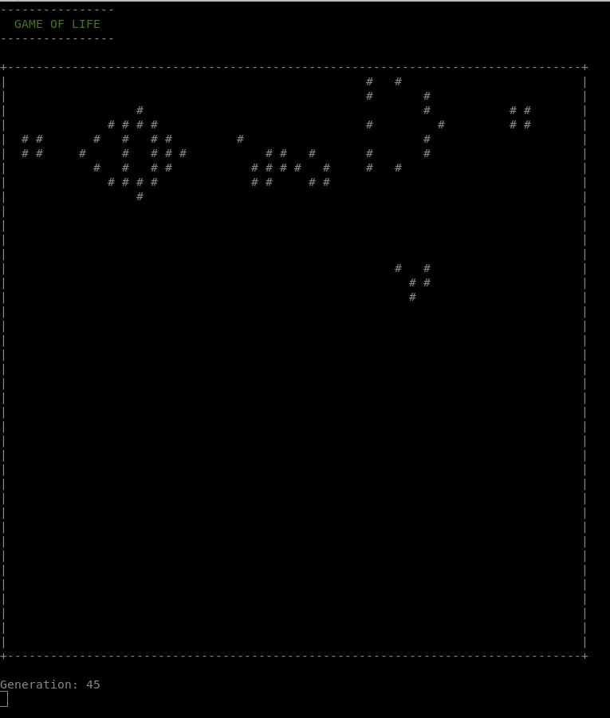

<p align="center">
  
</p>

# Game of Life

This project is a very simple C++ implementation of the "Game of Life," a cellular automaton devised by the British mathematician John Horton Conway in 1970. The Game of Life is not a conventional game, but a zero-player game, where evolution is determined by its initial state, requiring no further input. It's widely used in computer science and mathematics to study complex systems, emergent behaviors, and for entertainment.

The implementation runs in a terminal environment in fixed 40 x 40 grid and offers four hardcoded initial states: "glider," "frog," "gun" (Gosper glider gun), and "five" (5x5).

It's a basic, rudimentary version without a graphical interface, made just for fun.

## Features

- **Four Initial Configurations:** Choose from "glider," "frog," "gun," and "five" to start the simulation.
- **Customizable Generations:** Users can specify the number of generations for the simulation to run.

## Requirements

- C++ Compiler
- Standard C++ Libraries

## Installation

1. Clone the repository to your local machine.
2. run Makefile.

## Usage

Run the simulation with the following command format in the terminal:
```bash
./gameoflife <configuration> <generations>
```
Choose from four hardcoded initial configurations: "toad", "glider", "five" (5x5) or "gun" (Gosper glider gun).

## Example

Run the simulation for a "glider" configuration for 50 generations using the command:
```bash
./gameoflife gun 50
```
<p align="center">
  
</p>

-----------------------------------------------------------------------------------------------------------------
Header illustration: DALL-E 3
